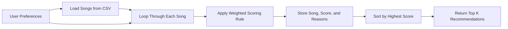

# 🎵 Music Recommender Simulation

## Project Summary

In this project you will build and explain a small music recommender system.

Your goal is to:

- Represent songs and a user "taste profile" as data
- Design a scoring rule that turns that data into recommendations
- Evaluate what your system gets right and wrong
- Reflect on how this mirrors real world AI recommenders

This project simulates a simple content-based music recommender. Real platforms like Spotify, TikTok, and YouTube combine many signals, including listening history, likes, skips, watch time, playlists, and what similar users enjoyed, to predict what a person might want next. My version keeps the idea small and transparent by focusing on song attributes inside the dataset, then comparing them against a user taste profile to rank songs that best match the user's vibe.

---

## How The System Works

Real-world recommenders usually mix two big approaches. Collaborative filtering looks at behavior patterns across many users, such as "people who liked this also liked that," while content-based filtering looks directly at the item's attributes, such as genre, mood, energy, tempo, or other audio features. My simulator uses the content-based approach because it is easier to explain: each song is treated like a bundle of features, each user profile stores target preferences, and the recommender calculates a weighted score for every song before sorting the catalog from highest to lowest.

For the simulation design, I expanded the original 10-song catalog to 18 songs so the dataset includes more variety across genres and moods such as EDM, folk, blues, metal, reggaeton, acoustic, and world. I kept the existing numeric features `energy`, `tempo_bpm`, `valence`, `danceability`, and `acousticness` because they capture different parts of a song's vibe. In my experience, energy alone is not enough to describe musical feel, so keeping valence and acousticness in the dataset gives the recommender room to distinguish between something intense, playful, peaceful, or dreamy even if two songs have similar tempo.

This version will prioritize genre and mood as the strongest categorical signals, then use energy as a numeric "closeness" score. Instead of rewarding songs for having higher energy in general, the system rewards songs that are closer to the user's target energy. That matters because a user who wants chill lofi should not get high-energy rock just because the energy value is large. After every song gets a score, a ranking rule sorts the list so the top `k` songs become the recommendations.

### Features Used

`Song` features:

- `title`
- `artist`
- `genre`
- `mood`
- `energy`
- `tempo_bpm`
- `valence`
- `danceability`
- `acousticness`

`UserProfile` features:

- `favorite_genre`
- `favorite_mood`
- `target_energy`
- `likes_acoustic`

### Example Taste Profile

This is the main user profile I plan to test first:

```python
{
    "favorite_genre": "lofi",
    "favorite_mood": "chill",
    "target_energy": 0.38,
    "likes_acoustic": True
}
```

I chose this profile because it should clearly separate "chill lofi" from "intense rock." A low target energy and acoustic preference should pull calmer songs upward, while the genre and mood fields help avoid recommending high-energy tracks that only happen to share one loose vibe feature.

### Algorithm Recipe

- Add `+2.0` points for a genre match because genre usually shapes the listener's main intent.
- Add `+1.0` point for a mood match because mood matters, but should not completely overpower genre.
- Add up to `+1.5` points for energy similarity using a closeness rule such as `1.5 * (1 - abs(song_energy - target_energy))`.
- Add a small acousticness bonus, such as `+0.5 * acousticness`, when the user likes acoustic songs.
- Add a small acousticness penalty, such as `+0.5 * (1 - acousticness)`, when the user prefers less acoustic songs.
- Sort songs by total score from highest to lowest and return the top `k` results.

### Why We Need Scoring and Ranking

- A scoring rule explains how one song is judged against one user profile.
- A ranking rule compares all scored songs against each other so the system can choose the best recommendations.

Without scoring, the system has no way to judge a single song. Without ranking, it has no way to turn many scored songs into a final recommendation list.

### Data Flow



### Potential Biases I Expect

- The system may over-prioritize genre and miss songs from other genres that still match the user's mood and energy.
- A small dataset can create a filter bubble because the recommender can only choose from a narrow catalog.
- If some moods or genres appear less often in the CSV, those listeners will get weaker or less varied results.
- A fixed user profile structure simplifies taste too much, so complex listeners may be poorly represented.

---

## Getting Started

### Setup

1. Create a virtual environment (optional but recommended):

   ```bash
   python -m venv .venv
   source .venv/bin/activate      # Mac or Linux
   .venv\Scripts\activate         # Windows

2. Install dependencies

```bash
pip install -r requirements.txt
```

3. Run the app:

```bash
python -m src.main
```

### Running Tests

Run the starter tests with:

```bash
pytest
```

You can add more tests in `tests/test_recommender.py`.

---

## Experiments You Tried

Planned experiments for later phases:

- Reduce the genre weight to see whether mood and energy create more diverse recommendations.
- Compare a chill lofi profile against an intense rock profile and check whether the rankings clearly separate.
- Test whether acousticness helps distinguish cozy tracks from high-energy synthetic tracks.

---

## Limitations and Risks

This recommender still has important limits. It only works on a tiny hand-written catalog, it cannot understand lyrics or context, and it depends heavily on the few features I selected. Even with more songs added, it may still over-favor whichever genres are most common in the CSV or whichever features receive the largest weights.

---

## Reflection

Read and complete `model_card.md`:

[**Model Card**](model_card.md)

Write 1 to 2 paragraphs here about what you learned:

- about how recommenders turn data into predictions
- about where bias or unfairness could show up in systems like this
